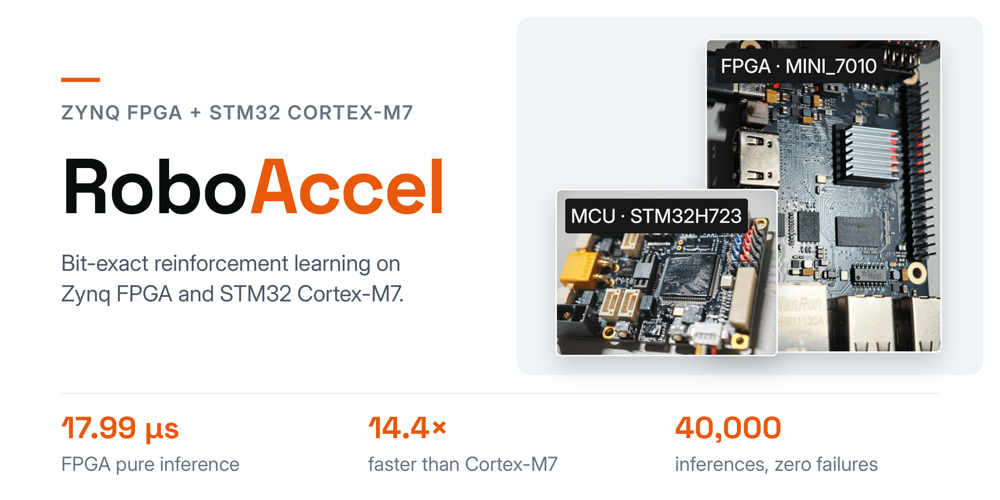
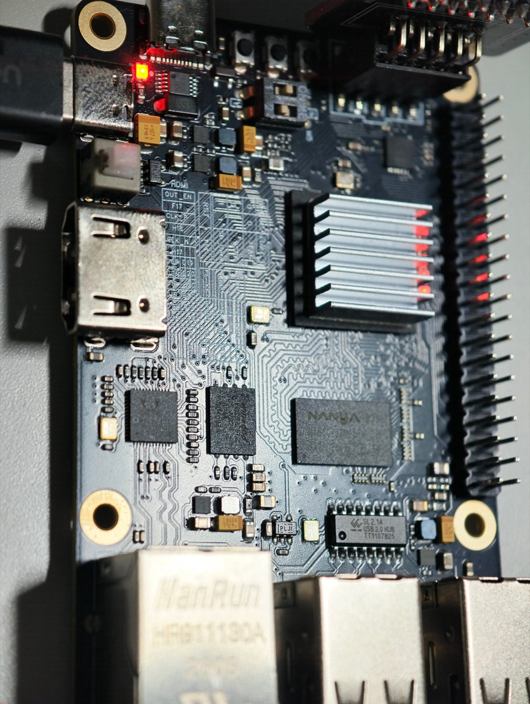
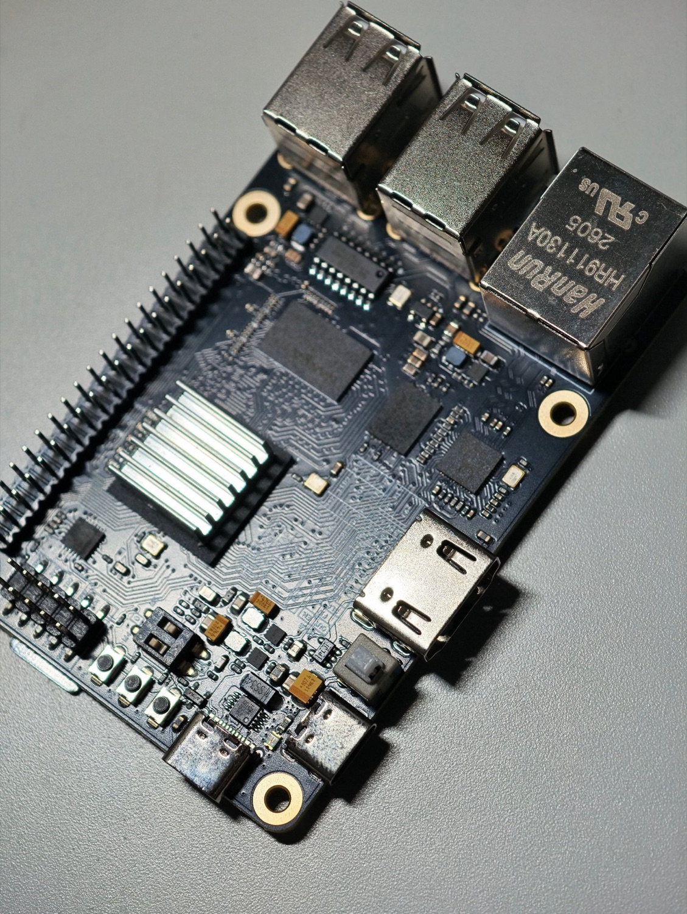
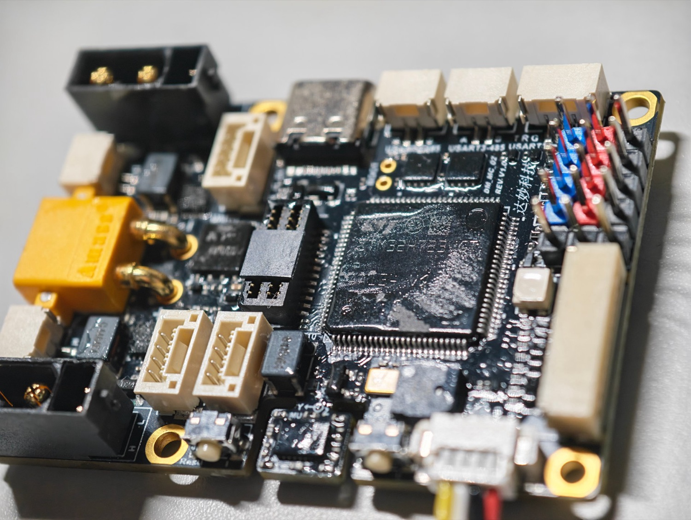
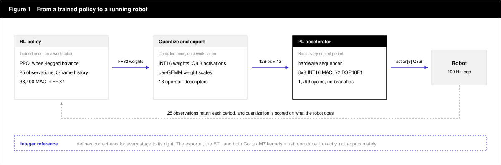
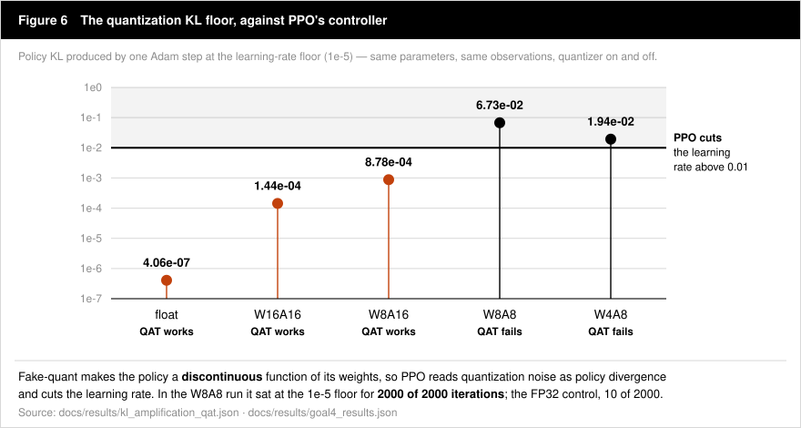

<p align="center">
  
</p>

<p align="center">
  <strong>Train in floating point. Verify in integers. Run on silicon.</strong>
</p>

<p align="center">
  <a href="LICENSE"></a>
  <a href="#the-result"></a>
  <a href="#the-result"></a>
</p>

<p align="center">
  <a href="#sixty-seconds-to-a-result">Quickstart</a> ·
  <a href="#built-flashed-measured">Hardware</a> ·
  <a href="#how-it-works">Architecture</a> ·
  <a href="#the-result">Results</a> ·
  <a href="#every-number-has-a-log">Verification</a> ·
  <a href="#where-it-breaks">Control quality</a> ·
  <a href="#go-deeper">Documentation</a>
</p>

---

## Two chips, one answer.

A trained robot policy, compiled for a **Zynq-7000 FPGA** and an **STM32H723 Cortex-M7** —
then checked until both are provably computing the same thing.

The demonstrated controller balances a **wheel-legged robot**: 25 observations, a 5-frame
history encoder, a 4-layer actor, 6 actions. **38,400 MACs**, deployed twice — once as a
programmable accelerator in programmable logic, once as hand-written C kernels.

| **17.99 µs** | **14.4×** | **40,000** | **0** |
| :---: | :---: | :---: | :---: |
| FPGA pure inference at 100 MHz PL | faster than the same policy on Cortex-M7 | inferences in one endurance run, zero failures | mismatches across 24 golden vectors, on silicon |

Nothing above is estimated. Every figure on this page is backed by a raw log, a
reproducible command, or a testbench — and where a result later turned out to be wrong,
the correction is still in the repository. That is the point.
[Evidence audit →](docs/EVIDENCE.md)

---

## Sixty seconds to a result.

**No board. No GPU. No checkpoint.** Linux, Python 3.10+ with `venv` and pip, plus GCC for
the C kernel check.

```bash
git clone https://github.com/Functionhx/RoboAccel.git
cd RoboAccel

python3 -m venv .venv
source .venv/bin/activate
python -m pip install numpy

# Compare the integer reference with the RTL and C arithmetic definitions.
python quantization/scripts/verify_against_rtl.py

# Compile both C kernel paths and check the included model's golden vectors.
bash quantization/scripts/hosttest/build_and_run.sh stm32/models/solid_v2
```

You should see:

```text
VERIFY_AGAINST_RTL: PASS
H7_HOST_CHECK: PASS
```

The first check reads the RTL and the C sources. The second executes the C kernels on your
host, using a portable equivalent of the ARM `SMLALD` instruction.

**Then run the RTL.** Five testbenches, no exported model required:

```bash
make -C fpga/tb primitives gemm concat sequencer top
```

Checkpoint export, additional test fixtures, calibration, and board setup live in the
**[deployment guide →](docs/GETTING_STARTED.md)**.

---

## Built, flashed, measured.

Two boards, one arithmetic contract. These are the physical units every number below comes
from.

<p align="center">
  
  
  
</p>

| | Deployed configuration |
| :--- | :--- |
| **FPGA** | MINI_7010 · XC7Z010CLG400 · 100 MHz PL |
| **MCU** | STM32H723VGT6 · 480 MHz · scalar and `SMLALD` SIMD kernels |
| Arithmetic | INT16 weights · Q8.8 activations and bias · INT48 accumulation |
| Compute | 72 DSP48E1 — 64 for GEMM, 8 for NORM |
| On-chip storage | 512 × 128-bit vector cache; 8 banks of 1280 × 128-bit weights |
| Program storage | 32 × 128-bit instruction RAM; 13 descriptors used |
| Boot and readback | JTAG boot; results read through a JTAG mailbox |

---

## How it works.

**One arithmetic contract, two deployment paths.** A NumPy integer reference defines
fixed-point rounding, saturation, and ELU behavior. Every implementation is checked
against it — that single decision is what makes the two targets comparable at all.

<p align="center">
  
</p>

- **Programmable execution.** The FPGA sequencer reads operator descriptors from
  instruction RAM. The demonstrated network uses 7 GEMM, 5 ELU, and 1 CONCAT operation;
  a second checkpoint with different weights and scales passes through the same RTL after
  re-export.
- **Deterministic inference.** An 8×8 INT16 MAC array with INT48 accumulation executes the
  deployed policy in 1,799 PL cycles, without data-dependent branches.
- **Control-aware evaluation.** Precision experiments measure balancing and command
  tracking in closed-loop simulation, alongside numerical agreement.

See the [architecture](docs/ARCHITECTURE.md),
[policy-to-accelerator mapping](docs/SOLID_POLICY_DEPLOYMENT_MAPPING.md), and
[second-checkpoint audit](docs/RELEASE_CANDIDATE.md#4-defect-found-diagnosed-and-fixed--in-the-testbench-not-the-rtl).

---

## The result.

The same **38,400-MAC policy**, on both targets. These are recorded hardware results; the
quickstart above performs host verification.

| Timing boundary | Zynq-7000 · 100 MHz PL | STM32H723 · 480 MHz | Speedup |
| :--- | ---: | ---: | ---: |
| **Pure inference (T1)** | **17.99 µs** | 259.09 µs | **14.4×** |
| Observation → action (T3) | 46.75–46.79 µs | 260.82 µs | **5.6×** |

T1 measures the integer computation with operands in local memory. T3 includes
input/output handling. The deployed FPGA path transfers observations and actions over
AXI4-Lite; that host traffic accounts for most of the additional latency.

FPGA T3 is from five batches of 100 inferences on MINI_7010 with Vivado/Vitis 2026.1.
STM32 timing uses DWT CYCCNT over 200 runs, with weights and activations in DTCM.
Sources: [FPGA board log](fpga/docs/11_mini7010_vivado2026_port.md),
[measurement audit](docs/EVIDENCE.md#hardware-performance).

<details>
<summary><strong>Endurance runs — 40,000 inferences, zero failures</strong></summary>

The current endurance run completed **40,000 inferences**, with **0 failures and
0 overruns**.

An earlier **Vivado 2020.2** build completed **2,200 inferences**, also with **0 failures
and 0 overruns**. Mean observation-to-action latency was **45.392 µs**
(45.334–46.101 µs); every output carried checksum `0xBAC07F44`. That run is a separate
build from the 2026.1 timing result above.
See the [2020.2 endurance log](fpga/docs/09_hardware_test_20260821.md).

The exporter enforces cache capacity and a program length of 1–32 descriptors. The host
must leave caches and instruction RAM untouched during an automatic sequence. Full
[capacity limits](docs/GETTING_STARTED.md#export-limits).

</details>

---

## Every number has a log.

Five implementations of one arithmetic contract — and one arbiter that decides what
"correct" means. The FPGA exporter shares no code with the quantization library, yet
derives the same program and the same per-layer scales.

<p align="center">
  
</p>

| Check | Recorded result |
| :--- | :--- |
| PyTorch fake-quant ↔ NumPy integer reference | **9/9 tensors exact** over 4,000 samples |
| Independent FPGA exporter ↔ quantization library | Identical 13 descriptors and 7 per-layer weight scales |
| STM32 scalar and `SMLALD` SIMD ↔ golden vectors | **0 mismatches / 24 vectors**, on silicon |
| RTL simulation ↔ two FPGA board builds | Identical actions for the same reference input |

<details>
<summary><strong>Inspect the matching actions</strong></summary>

The recorded Q8.8 action vector is identical in RTL simulation and on both board builds:

```text
RTL simulation       543  790  74  635  478  -796
Vivado 2020.2 board  543  790  74  635  478  -796
Vivado 2026.1 board  543  790  74  635  478  -796
```

Read the raw [2020.2 UART log](fpga/docs/09_hardware_test_20260821.md) and
[2026.1 JTAG mailbox log](fpga/docs/11_mini7010_vivado2026_port.md). The
[release audit](docs/RELEASE_CANDIDATE.md) records the host reproduction, including its
scope and the testbench defect it found and fixed.

</details>

---

## Where it breaks.

**The cliff is at 4-bit weights, not 8-bit activations.** In the recorded precision sweep,
reducing weight precision to 8 bits preserved control success. Reducing *activations* to
8 bits appeared to destroy it — until the activation scales were recalibrated.

<p align="center">
  
</p>

| Precision | Activation scales | Mean control success | Mean wheel support | Model bytes |
| :--- | :--- | ---: | ---: | ---: |
| FP32 | — | 1.000 | 1.000 | — |
| **W16A16 · deployed** | fixed Q8.8 | **1.000** | **1.000** | **78,412** |
| W8A16 | fixed Q8.8 | 1.000 | 1.000 | 40,012 |
| W8A8 | peak + 1.25× headroom | 0.041 | 0.936 | 39,631 |
| **W8A8** | **99.5th percentile** | **1.000** | **1.000** | **39,631** |
| W4A8 | 99.5th percentile | 0.000 | 0.658 | 20,431 |

Seven command segments, **one training seed**, evaluated in closed-loop simulation.
W/A denotes weight/activation bit width. Sources:
[raw results](docs/results/ladder_pooled.json),
[per-segment figure](assets/precision_cliff.svg),
[evidence and caveats](docs/EVIDENCE.md#control-quality).

**The two W8A8 rows are the same arithmetic on the same weights.** They differ only in
how eight fractional-bit values were chosen. Because the requantizer is a shifter, every
scale is a power of two, so one outlier past a binade boundary costs a whole bit for
every other sample — under the original peak-based rule, no tensor used even 40% of
INT8's range. Clipping at the 99.5th percentile instead saturates 0.115% of samples.
This **retracts** a claim published here earlier, that the precision cliff sits at 8-bit
activations; it sits at 4-bit weights. Across three independently trained policies, the
same change moves mean success from 0.285 to 0.906.

W8A8 still tracks less accurately than W8A16 — yaw RMSE 0.0867 / 0.0976 against FP32's
0.0191 / 0.0178, where W8A16 is within 13% — and success is a threshold metric, so
W16A16 remains the deployed baseline.

**Every row below W16A16 is a simulation result.** The exporter emits INT16 weights, and
until recently fixed `ACT_FRAC = 8` as a module constant, so no calibrated activation
configuration had ever been exportable. The per-layer shift path now exists and is
verified against the RTL, but tensors feeding an ELU still need `AFFINE` conversion
pairs that are not yet emitted. Nothing below W16A16 has run on hardware. See
[the deployability analysis](docs/qat_failure/goal6_root_cause.md#12-can-any-of-this-actually-be-deployed).

---

## Why quantization-aware training could not recover control.

Three interventions were tried, and all three failed with their targets verifiably
controlled: fixing the learning rate, freezing the encoder bit-identically for 2000
iterations, and anchoring the policy to a frozen FP32 teacher.

<p align="center">
  
</p>

Measured without any RL in the loop, W8A16 fits the FP32 policy to within PPO's own KL
threshold and W8A8 cannot get within 32× of it — so QAT fails on a representational limit,
not an optimizer pathology. Most of the collapse that motivated the investigation was the
calibration above.

Read the [root-cause analysis](docs/qat_failure/goal6_root_cause.md),
[QAT findings](docs/QAT_RESULTS.md), and [research record](docs/qat_failure/), including
failed hypotheses and retractions.

---

## Go deeper.

| I want to… | Start here |
| :--- | :--- |
| Export a checkpoint or prepare a board | [Deployment guide](docs/GETTING_STARTED.md) |
| Understand the arithmetic and component interfaces | [Architecture](docs/ARCHITECTURE.md) · [Integer reference](quantization/roboaccel_quant/) |
| Work on the FPGA | [RTL](fpga/rtl/) · [Testbenches](fpga/tb/) · [Register map](fpga/docs/04_register_map.md) |
| Work on the MCU | [C kernels](stm32/src/) · [Build and flash scripts](stm32/scripts/) |
| Reproduce quantization experiments | [QAT reproduction](docs/REPRODUCE_QAT.md) · [Training adapters](training/scripts/) |
| Check a claim or reproduce verification | [Evidence audit](docs/EVIDENCE.md) · [Release audit](docs/RELEASE_CANDIDATE.md) · [Raw results](docs/results/) |
| Learn the design and debugging history | [Knowledge transfer](docs/knowledge_transfer/index.md) · [Failed hypotheses](docs/knowledge_transfer/06_failed_hypotheses.md) |

Architecture, hardware, and knowledge-transfer notes include Chinese prose; technical
identifiers and code remain in English.

## License and attribution

[MIT](LICENSE). The accelerator derives from `rl_on_fpga` (© 2026 DreamChaser), with the
original copyright preserved.

The training environment and robot assets are external dependencies and are not
included; this repository ships the adapters. STM32 hardware builds also need external
ST HAL sources and an ARM toolchain. See [NOTICE.md](NOTICE.md).

---

<p align="center">
  <strong>Reproducing a result and getting something different?</strong><br>
  <a href="https://github.com/Functionhx/RoboAccel/issues">Open an issue</a> ·
  <a href="https://github.com/Functionhx/RoboAccel/pulls">Open a pull request</a><br>
  Include the command, model configuration, tool versions, and expected versus observed
  output — a result nobody else can reproduce is not yet a result.
</p>
