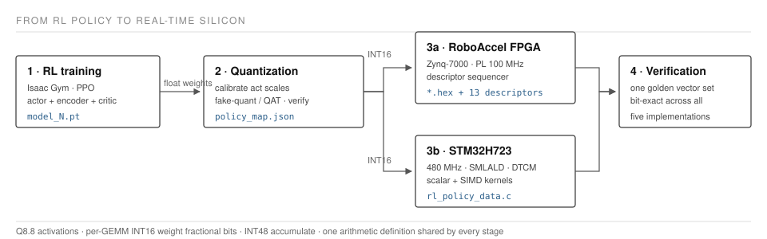

<div align="center">

# RoboAccel

### From RL Policy to Real-Time Silicon

**An End-to-End RL Control Deployment Stack for FPGA and MCU**

Train a reinforcement-learning controller, quantize it, verify it **bit-exactly**
against the hardware it will run on, and deploy it to an FPGA accelerator or a
Cortex-M7 — through one reproducible stack.



</div>

---

## What this is

A wheel-legged robot controller (25 observations → 5-frame history encoder →
4-layer actor → 6 actions, 38,400 MAC) that must run in **fixed-point integer
arithmetic** on embedded hardware. This repository contains everything from the
quantization boundary downward: the fixed-point reference, the verification
chain, the FPGA compiler, and the MCU backend.

```
RL Training  (external dependency — see NOTICE.md)
     ↓  float32 checkpoint
Quantization  ── calibration → QAT / PTQ → fixed-point reference
     ↓
Bit-exact verification  ── 5 independent implementations must agree
     ↓
     ├──────────────────────────┐
     ↓                          ↓
RoboAccel FPGA              STM32H723
Zynq-7000, 17.99 µs         480 MHz, 259.09 µs
```

## Key results

All numbers below are **measured**, not projected. Estimates and unmeasured
configurations are marked as such.

### Hardware — measured

| Target | Pure inference | Method |
|---|---|---|
| **RoboAccel** (Zynq-7000, PL 100 MHz) | **17.99 µs** (1,799 PL cycles) | cycle model, board-validated |
| **STM32H723** (480 MHz, SMLALD + DTCM) | **259.09 µs** (124,363 cycles) | on silicon, 200 runs, DWT CYCCNT |
| **Speedup** | **14.4×** | both measured |

STM32 obs→action end-to-end: 260.82 µs. 3.25 cycles/MAC.

### Numerical verification — measured

**Five independent implementations agree bit-exactly** on the same weights:


| Implementation | Verified |
|---|---|
| PyTorch fake-quant | 9/9 tensors exact, 4000 samples |
| NumPy integer reference *(arbiter)* | — |
| FPGA descriptor program | same 13 instructions, same 7 weight fracs |
| STM32 scalar C | 0 mismatches, 24 golden vectors, **on silicon** |
| STM32 SMLALD SIMD | 0 mismatches, **on silicon** |

The FPGA exporter shares no code with the quantization library and independently
derives the identical program and per-layer scales.

### Control quality vs precision — measured

Seven command segments (forward / reverse / turn ×2 / stop / height / combined),
three training seeds, evaluated closed-loop.

| Precision | Success | Wheel support | Model bytes |
|---|---|---|---|
| FP32 | **1.000** | **1.000** | — |
| **W16A16** *(deployed)* | **1.000** | **1.000** | 78,412 |
| W8A16 | **1.000** | **1.000** | 40,012 |
| W8A8 | 0.000–0.164 | 0.915–0.950 | 39,631 |
| W4A8 | 0.000 | 0.239 | 20,431 |


**The quantization cliff is exactly at 8-bit activations.** INT8 weights are
free; INT8 activations are not.

> **Deployment baseline: W16A16.** W8A16 shows no measured control degradation,
> but the current exporter is INT16/Q8.8 by construction and **cannot emit INT8
> weights** — shipping W8A16 requires adding a bit-width parameter to the export
> path first. See `docs/QAT_RESULTS.md`.

### Why QAT fails at W8A8 — measured

At W8A8, quantization-aware training reliably restores **wheel support**
(95–100% recovery, three seeds) and substantially restores straight-line
locomotion (39–84%, seed-dependent), but **never restores turning**
(0.000 across all seeds — worse than plain PTQ).

**The reason is not that 8-bit activations cannot represent the policy. It is
that 8-bit activations break the training algorithm's ability to control its own
step size.**


PPO adapts its learning rate from the measured policy KL — if KL is too large,
take smaller steps. That control loop assumes KL is monotone in step size.
Under fake-quant it is not: a weight step below one quantization LSB changes
nothing, while a step that crosses an LSB boundary snaps that weight by a whole
LSB. So the measured KL is set by how many weights happened to cross a
boundary, and **lowering the learning rate does not lower it**.

| | W8A8 QAT | FP32 control |
|---|---|---|
| Learning rate at its 1e-5 floor | **2000 / 2000 iterations** | 10 / 2000 |
| Median measured policy KL | 0.0650 | 0.0054 |
| Iterations above the controller's 0.01 threshold | **100%** | 0.1% |
| Reward at convergence | 28.64 | 29.30 |

One 1e-5 weight step — the algorithm's own floor — produces a policy KL of
**6.73e-02** under W8A8 fake-quant against **4.06e-07** in float: **165,737×**.
That is 6.7× the controller's threshold *at zero effective learning rate*, so
the rate was driven to the floor and never rose again.

Three consequences, all measured:

- **QAT never repaired anything.** Turning was already broken at iteration 1
  (yaw RMSE 0.1468) and was no better after 2000 iterations (0.1566).
- **Reward shaping cannot help.** Raising the yaw reward 2× and 4× scaled its
  contribution exactly 2.00× and 4.00× and moved yaw RMSE by 0.8%. You cannot
  steer an optimizer that cannot step.
- **The training curve looked healthy the whole time.** Reward 28.64 vs the
  control's 29.30. Only the learning-rate trace shows the failure.

**W8A8 is the only precision on the ladder whose quantization KL floor exceeds
the controller's threshold — and the only one where QAT fails.** The noise floor
predicts trainability from a single forward pass, with no training run at all.

See [`docs/qat_failure/`](docs/qat_failure/) for the complete research record
and `docs/01_localization.md`. Full evidence grading: `docs/EVIDENCE.md`.

## Quick start

```bash
# 0. environment
source training/scripts/env_solid.sh

# 1. verify the arithmetic before trusting any result
python quantization/scripts/verify_against_rtl.py
python quantization/scripts/bitexact_check.py --checkpoint <ckpt> --n 4000 \
       --weight-bits 16 --act-bits 16

# 2. calibrate activation scales from on-policy rollouts
python training/scripts/dump_calib_obs.py --checkpoint <ckpt> --out calib.npz \
       --steps 400 --headless --num_envs 256
python quantization/scripts/calibrate_act_fracs.py --checkpoint <ckpt> \
       --obs calib.npz --act-bits 8 --out fracs.json

# 3. export
python quantization/scripts/export_to_onnx.py <ckpt> --out policy.onnx
python fpga/tools/export_policy.py --model policy.onnx --out generated \
       --samples 1000 --seed 7

# 4. FPGA regression (no board required)
make -C fpga/tb all

# 5. STM32 build + host equivalence (no board required)
python quantization/scripts/gen_h7_branched.py policy.onnx --name mymodel \
       --out stm32/models/mymodel --golden 24 --golden-npz calib.npz
bash quantization/scripts/hosttest/build_and_run.sh stm32/models/mymodel

# 6. flash + benchmark (board required)
cd stm32 && bash scripts/flash.sh mymodel && python scripts/read_results.py mymodel
```

## Repository layout

```
training/       adapter + drivers. The RL environment itself is an external
                dependency and is NOT vendored — see NOTICE.md
quantization/   roboaccel_quant/ : fixed-point reference (arbiter), torch
                fake-quant with STE, quantized policy module
                scripts/ : calibration, verification, diagnostics, export
fpga/           rtl/ tb/ tools/ sw/ — accelerator, 8 Icarus testbenches,
                ONNX→descriptor compiler
stm32/          Cortex-M7 backend: scalar + SMLALD kernels, DTCM placement,
                DWT benchmarking, JTAG mailbox readback
docs/           knowledge_transfer/ (13 documents), results, deployment mapping
```

## Documentation

| Document | Contents |
|---|---|
| `docs/knowledge_transfer/` | 13 documents: debugging history, design decisions, **failed hypotheses**, experiment interpretation, verification chain, operations playbook |
| `docs/QAT_RESULTS.md` | Full results with evidence grading and retractions |
| `docs/SOLID_POLICY_DEPLOYMENT_MAPPING.md` | Layer-by-layer policy → accelerator mapping |
| `docs/REPRODUCE_QAT.md` | Reproduction recipe |
| `docs/EVIDENCE.md` | **Every README claim traced to a source and classified** measured / reproduced / estimated / hypothesis, plus retractions |
| `docs/ARCHITECTURE.md` | Canonical artifacts, interfaces between the four components, and known fragile boundaries |
| `docs/results/` | The raw JSON behind the figures and tables |

The knowledge-transfer documents are written in Chinese with English technical
terminology and identifiers preserved.

## What this project got wrong

Kept deliberately, because negative results are results:

- **"QAT recovers 86–101%"** — held only on a task where the robot rested on its
  chassis instead of balancing. A corrected simulation reduced it to
  straight-line motion only.
- **"The latent is the quantization bottleneck"** — layer ablation put it at
  13%; leave-one-out then refuted any single-layer explanation.
- **"The requantizer's rounding bias causes the turning failure"** — retraining
  against a corrected requantizer left turning at exactly 0.000.
- **"The yaw reward is starved, so rebalance it"** — quadrupling it moved yaw
  RMSE by 0.8%. The optimizer was pinned at its learning-rate floor the whole
  time; no objective change could have mattered.
- **"QAT beats FP32"** — it did on numerical MSE (0.1334 vs 0.2898). Control
  metrics reached 0.0657. The gain was extra training, not quantization
  awareness. **MSE is not evidence of control quality.**

See `docs/knowledge_transfer/06_failed_hypotheses.md`.

## Licence

MIT. The accelerator derives from `rl_on_fpga` (MIT, © 2026 DreamChaser); that
copyright is preserved. The RL environment is **not** included and is **not
redistributable** — see `NOTICE.md`.
