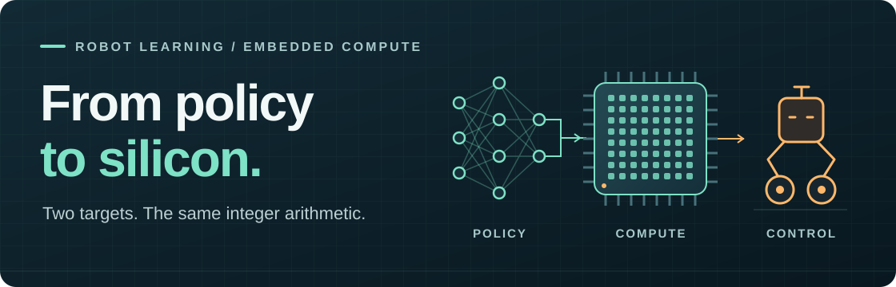
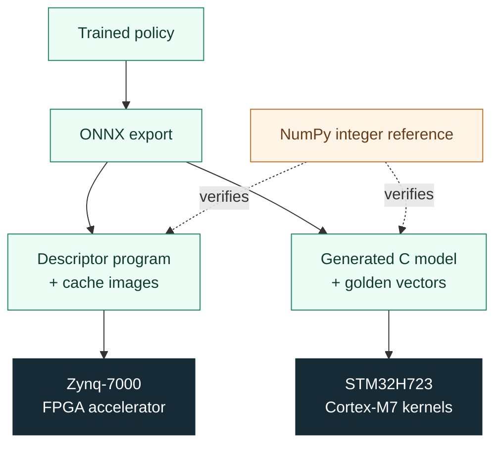

<h1 align="center">RoboAccel</h1>

<p align="center">
  <strong>Bit-exact reinforcement learning on FPGA and Cortex-M7.</strong><br>
  Train in floating point. Verify in integers. Run on silicon.
</p>

<p align="center">
  <a href="LICENSE"></a>
  <a href="#hardware-results"></a>
  <a href="#hardware-results"></a>
</p>

<p align="center">
  <a href="#quickstart">Quickstart</a> ·
  <a href="#how-it-works">Architecture</a> ·
  <a href="#hardware-results">Hardware results</a> ·
  <a href="#control-quality">Control quality</a> ·
  <a href="#explore-the-project">Documentation</a>
</p>

<p align="center">
  
</p>

RoboAccel compiles trained robot policies for **Zynq FPGA** and **STM32 Cortex-M7**.
It checks numerical agreement across the deployment pipeline, then evaluates
balancing and command tracking in closed-loop simulation.

The demonstrated policy controls a **wheel-legged balancing robot**: 25
observations, a 5-frame history encoder, a 4-layer actor, and 6 actions.

| **17.99 µs** | **13 instructions** | **2,200 / 2,200** |
| :---: | :---: | :---: |
| FPGA pure inference at 100 MHz | One register write starts the network | Passed in a recorded FPGA endurance run |

Timing boundaries, toolchains, and sources are listed in [Hardware results](#hardware-results).

## Quickstart

**Get a result without a board, GPU, or checkpoint.** On Linux, use Python 3.10+
with `venv` and pip, plus GCC for the C kernel check.

```bash
git clone https://github.com/Functionhx/RoboAccel.git
cd RoboAccel

python3 -m venv .venv
source .venv/bin/activate
python -m pip install numpy

# Compare the integer reference with the RTL and C arithmetic definitions.
python quantization/scripts/verify_against_rtl.py

# Compile both C kernel paths and check the included model's golden vectors.
bash quantization/scripts/hosttest/build_and_run.sh stm32/models/solid_v2
```

Look for:

```text
VERIFY_AGAINST_RTL: PASS
H7_HOST_CHECK: PASS
```

The first check reads the RTL and C sources. The second executes the C kernels
on your host, using a portable equivalent of the ARM SMLALD instruction.

**Run the RTL too.** With Icarus Verilog (`iverilog` and `vvp`) and Make installed:

```bash
make -C fpga/tb primitives gemm concat sequencer top
```

These five testbenches need no exported model. For checkpoint export,
additional test fixtures, calibration, and board setup, follow the
**[deployment guide →](docs/GETTING_STARTED.md)**.

## How it works

**One arithmetic contract, two deployment paths.** The NumPy reference defines
fixed-point rounding, saturation, and ELU behavior. Each implementation is
checked against it.



- **Programmable execution.** The FPGA sequencer reads operator descriptors
  from instruction RAM. The demonstrated network uses 7 GEMM, 5 ELU, and 1
  CONCAT operations; a second checkpoint with different weights and scales
  passes through the same RTL after re-export.
- **Deterministic inference.** An 8×8 INT16 MAC array with INT48 accumulation
  executes the deployed policy in 1,799 PL cycles, without data-dependent branches.
- **Control-aware evaluation.** Precision experiments measure balancing and
  command tracking in simulation alongside numerical agreement.

See the [architecture](docs/ARCHITECTURE.md),
[policy-to-accelerator mapping](docs/SOLID_POLICY_DEPLOYMENT_MAPPING.md), and
[second-checkpoint audit](docs/RELEASE_CANDIDATE.md#4-defect-found-diagnosed-and-fixed--in-the-testbench-not-the-rtl).

## Hardware results

The same **38,400-MAC policy** runs on both targets. These are recorded hardware
results; the quickstart above performs host verification.

| Timing boundary | Zynq-7000 · 100 MHz PL | STM32H723 · 480 MHz | Speedup |
| :--- | ---: | ---: | ---: |
| **Pure inference (T1)** | **17.99 µs** | 259.09 µs | **14.4×** |
| Observation → action (T3) | 46.75–46.79 µs | 260.82 µs | **5.6×** |

T1 measures the integer computation with operands in local memory. T3 includes
input/output handling. The deployed FPGA path transfers observations and actions
over AXI4-Lite; this host traffic accounts for most of the additional latency.

FPGA T3 is from five batches of 100 inferences on MINI_7010 with Vivado/Vitis
2026.1. STM32 timing uses DWT CYCCNT over 200 runs, with weights and activations
in DTCM. Sources: [FPGA board log](fpga/docs/11_mini7010_vivado2026_port.md),
[measurement audit](docs/EVIDENCE.md#hardware-performance).

<details>
<summary><strong>Hardware configuration and endurance run</strong></summary>

| Component | Deployed configuration |
| :--- | :--- |
| FPGA | MINI_7010 · XC7Z010CLG400 · 100 MHz PL |
| Arithmetic | INT16 weights · Q8.8 activations and bias · INT48 accumulation |
| Compute resources | 72 DSP48E1: 64 for GEMM, 8 for NORM |
| On-chip storage | 512 × 128-bit vector cache; 8 banks of 1280 × 128-bit weights |
| Program storage | 32 × 128-bit instruction RAM; 13 descriptors used |
| FPGA boot | JTAG; results read through a JTAG mailbox |
| MCU | STM32H723VGT6 · 480 MHz · scalar and SMLALD SIMD kernels |

An earlier **Vivado 2020.2** build completed **2,200 inferences**, with **0 failures
and 0 overruns**. Mean observation-to-action latency was **45.392 µs**
(45.334–46.101 µs); all outputs had checksum `0xBAC07F44`.
This is a separate build from the 2026.1 timing result above.
See the [endurance log](fpga/docs/09_hardware_test_20260821.md).

The exporter enforces cache capacity and a program length of 1–32 descriptors.
The host must leave caches and instruction RAM untouched during an automatic
sequence. Full [capacity limits](docs/GETTING_STARTED.md#export-limits).

</details>

### Bit-exact verification

| Check | Recorded result |
| :--- | :--- |
| PyTorch fake-quant ↔ NumPy integer reference | **9/9 tensors exact** over 4,000 samples |
| Independent FPGA exporter ↔ quantization library | Identical 13 descriptors and 7 per-layer weight scales |
| STM32 scalar and SMLALD SIMD ↔ golden vectors | **0 mismatches / 24 vectors**, on silicon |
| RTL simulation ↔ two FPGA board builds | Identical actions for the same reference input |

<details>
<summary><strong>Inspect the matching actions</strong></summary>

The recorded Q8.8 action vector is identical in RTL simulation and on the two
board builds:

```text
RTL simulation       543  790  74  635  478  -796
Vivado 2020.2 board  543  790  74  635  478  -796
Vivado 2026.1 board  543  790  74  635  478  -796
```

Read the raw [2020.2 UART log](fpga/docs/09_hardware_test_20260821.md) and
[2026.1 JTAG mailbox log](fpga/docs/11_mini7010_vivado2026_port.md).
The [release audit](docs/RELEASE_CANDIDATE.md) records the host reproduction,
including its scope and the testbench defect it found and fixed.

</details>

## Control quality

**W16A16 is the deployed baseline.** In the recorded precision sweep, reducing
weight precision to 8 bits preserved control success; reducing activations to
8 bits sharply reduced it.

| Precision | Mean control success | Mean wheel support | Model bytes |
| :--- | ---: | ---: | ---: |
| FP32 | 1.000 | 1.000 | — |
| **W16A16 · deployed** | **1.000** | **1.000** | **78,412** |
| W8A16 | 1.000 | 1.000 | 40,012 |
| W8A8 | 0.041 | 0.936 | 39,631 |
| W4A8 | 0.000 | 0.394 | 20,431 |

Seven command segments, **one training seed**, evaluated in closed-loop
simulation. W/A denotes weight/activation bit width. Sources:
[raw results](docs/results/ladder_pooled.json),
[per-segment figure](assets/precision_cliff.svg),
[evidence and caveats](docs/EVIDENCE.md#control-quality).

W8A16 is an experimental result: the current deployment exporter emits INT16
weights and Q8.8 activations. Deploying 8-bit weights requires exporter changes.

**Why didn't W8A8 QAT recover control?** The experiments found a reproducible
learning-rate collapse, but fixing the learning rate did not restore turning.
Read the [QAT findings](docs/QAT_RESULTS.md),
[intervention results](docs/qat_failure/goal5_mechanism_confirmation.md), and
[research record](docs/qat_failure/), including failed hypotheses and retractions.

## Explore the project

| I want to… | Start here |
| :--- | :--- |
| Export a checkpoint or prepare a board | [Deployment guide](docs/GETTING_STARTED.md) |
| Understand the arithmetic and component interfaces | [Architecture](docs/ARCHITECTURE.md) · [Integer reference](quantization/roboaccel_quant/) |
| Work on the FPGA | [RTL](fpga/rtl/) · [Testbenches](fpga/tb/) · [Register map](fpga/docs/04_register_map.md) |
| Work on the MCU | [C kernels](stm32/src/) · [Build and flash scripts](stm32/scripts/) |
| Reproduce quantization experiments | [QAT reproduction](docs/REPRODUCE_QAT.md) · [Training adapters](training/scripts/) |
| Check a claim or reproduce verification | [Evidence audit](docs/EVIDENCE.md) · [Release audit](docs/RELEASE_CANDIDATE.md) · [Raw results](docs/results/) |
| Learn the design and debugging history | [Knowledge transfer](docs/knowledge_transfer/index.md) · [Failed hypotheses](docs/knowledge_transfer/06_failed_hypotheses.md) |

Architecture, hardware, and knowledge-transfer notes include Chinese prose;
technical identifiers and code remain in English.

Found an issue or want to improve a backend? [Open an issue](https://github.com/Functionhx/RoboAccel/issues)
or a pull request. Include the command, model configuration, tool versions, and
expected versus observed output so the result can be reproduced.

## License and attribution

[MIT](LICENSE). The accelerator derives from `rl_on_fpga`
(© 2026 DreamChaser), with the original copyright preserved.

The training environment and robot assets are external dependencies and are
not included; this repository ships the adapters. STM32 hardware builds also
need external ST HAL sources and an ARM toolchain. See [NOTICE.md](NOTICE.md).
