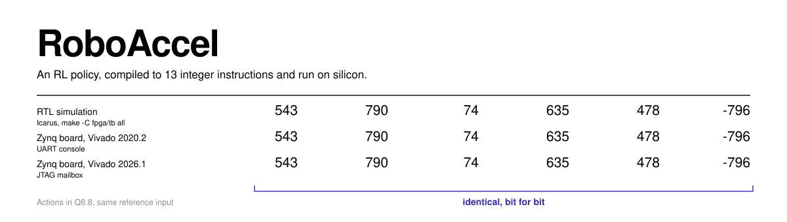
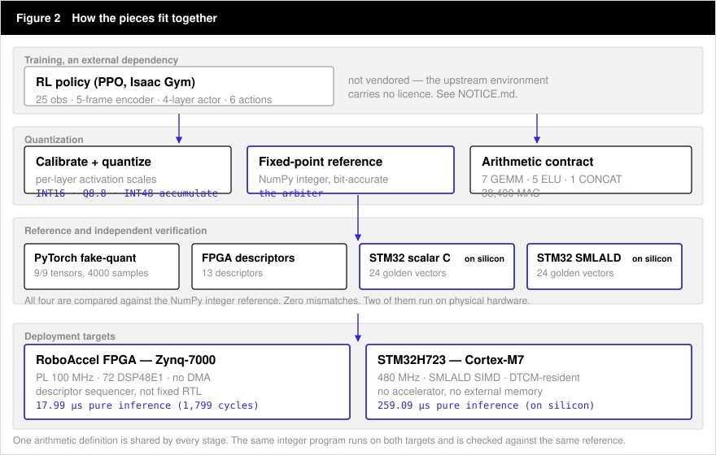
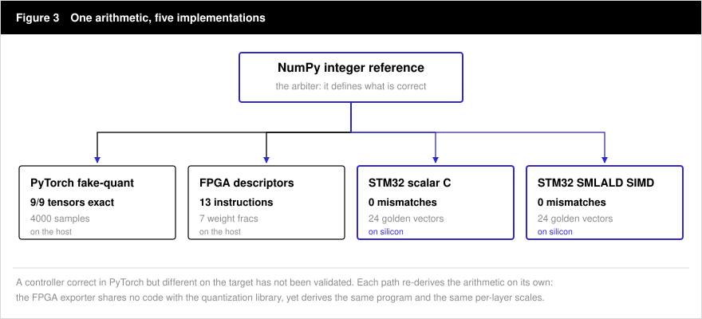
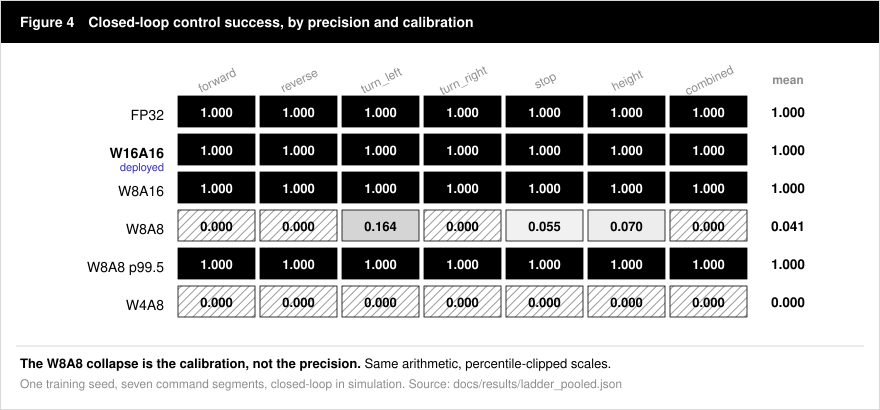
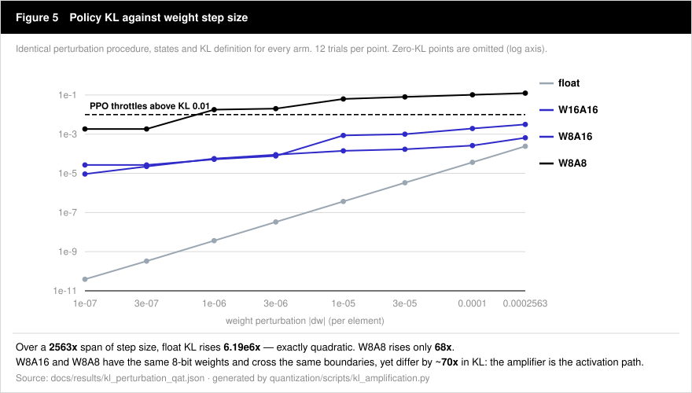

<div align="center">




</div>

A policy is trained in floating point. **RoboAccel turns it into a precisely
specified integer program**, proves the arithmetic survived deployment through
several independently written implementations, and runs the same controller
deterministically on an FPGA accelerator and on a Cortex-M7 — then checks
whether the robot still walks, not merely whether tensor error is small.

The target is a wheel-legged balancing robot: 25 observations, a 5-frame
history encoder, a 4-layer actor, 6 actions, 38,400 MAC.

---

## At a glance

Measured on hardware. Nothing here is projected.

|                          | RoboAccel FPGA                     | STM32H723                        |
| ------------------------ | ---------------------------------- | -------------------------------- |
| Silicon                  | Zynq-7000 `XC7Z010`                | Cortex-M7                        |
| Clock                    | PL 100 MHz                         | 480 MHz                          |
| **Pure inference**       | **17.99 µs** · 1,799 PL cycles     | **259.09 µs** · 124,363 cycles   |
| How it was obtained      | RTL testbench cycle count, board-validated | DWT CYCCNT on silicon, 200 runs |
| obs→action on hardware   | 46.75–46.79 µs                     | 260.82 µs                        |
| Compute                  | 72 DSP48E1, INT48 accumulate       | SMLALD SIMD, DTCM-resident       |
| Numerics                 | INT16, Q8.8 activations            | INT16, Q8.8 activations          |
| Verified                 | 13-descriptor program vs reference | 0 mismatches / 24 golden vectors |

**14.4× faster at pure inference.** At the full obs→action boundary the gap
narrows to **5.6×**, because this Zynq part has no DMA and the PS pushes every
input and pulls every output over AXI4-Lite. Both boundaries are stated because
quoting only the flattering one would make the speedup an argument rather than a
measurement.

---

## Why RoboAccel

Not a GEMM accelerator, and not a quantization notebook. It is the part of the
chain that is usually skipped.

**End to end.** The pipeline starts at an RL checkpoint and finishes at an
integer program running on embedded silicon. No step is left as an exercise.

**Bit-exact, not approximate.** Hardware arithmetic is checked against an
integer reference — including the requantizer's floor-after-half-LSB rounding,
which is *reproduced* rather than corrected, because silicon is the reference.

**Closed-loop.** Quantization is judged by whether the robot completes seven
command segments, not by tensor MSE. That distinction retired one of this
project's own headline claims.

**Cross-target.** One policy, one arithmetic definition, two backends with
nothing in common: a descriptor-programmed FPGA sequencer and a bare-metal
Cortex-M7.

**Reproducible and graded.** Every headline number in this README is traced to
a source file and classified in [`docs/EVIDENCE.md`](docs/EVIDENCE.md) —
measured, reproduced, estimated, or hypothesis. Retractions are listed there too.

---

## Architecture



The network topology is **not** hardcoded in RTL. The PS writes a program of
operator descriptors into a 32×128-bit instruction RAM, and a hardware sequencer
executes the whole network from a single register write. Deploying a different
policy means re-exporting cache images and a descriptor program — not rewriting
RTL.

---

## Bit-exact verification

A neural controller that looks correct in PyTorch but differs numerically on the
target has not been validated — it has been spot-checked. RoboAccel therefore
runs the same policy through several independently written arithmetic paths and
requires them to agree exactly.



| Implementation             | Result                                | Where       |
| -------------------------- | ------------------------------------- | ----------- |
| NumPy integer reference    | *the arbiter — defines correctness*   | host        |
| PyTorch fake-quant         | 9/9 tensors exact, 4000 samples       | host        |
| FPGA descriptor program    | same 13 instructions, same 7 weight fracs | host + board |
| STM32 scalar C             | 0 mismatches, 24 golden vectors       | **silicon** |
| STM32 SMLALD SIMD          | 0 mismatches, 24 golden vectors       | **silicon** |

The FPGA exporter shares no code with the quantization library and still derives
the identical instruction program and the identical per-layer scales. Agreement
between them is evidence, not construction.

---

## Quantization is not just an inference problem



Seven command segments, evaluated closed-loop. **The cliff is at 8-bit
activations, not 8-bit weights** — W8A16 is indistinguishable from FP32, W8A8
collapses.

| Precision                 | Success (mean) | Wheel support | Model bytes |
| ------------------------- | -------------: | ------------: | ----------: |
| FP32                      |      **1.000** |     **1.000** |           — |
| **W16A16** *(deployed)*   |      **1.000** |     **1.000** |      78,412 |
| W8A16                     |      **1.000** |     **1.000** |      40,012 |
| W8A8                      |  0.041 [0, 0.164] | 0.936 [0.915, 0.950] |  39,631 |
| W4A8                      |          0.000 | 0.394 [0.239, 0.480] |  20,431 |

*One training seed; ranges are across the seven segments. The QAT-versus-PTQ
comparison below is three-seed.*

> **Deployment baseline is W16A16.** W8A16 shows no measured control
> degradation, but the exporter is INT16/Q8.8 by construction and cannot emit
> INT8 weights, so shipping W8A16 would require a bit-width parameter in the
> export path first.

### Why quantization-aware training fails at W8A8

QAT is supposed to fix this. It does not — and the reason is not that 8-bit
activations cannot represent the policy.



Fake-quantization makes the policy a **discontinuous** function of its weights:
a step below one quantization LSB changes nothing, a step across an LSB boundary
snaps that weight by a whole LSB. PPO's adaptive controller regulates its
learning rate by measured policy KL, and reads that discontinuity as divergence.

The controller assumes KL grows with step size. Over a 2563× span of
perturbation magnitude, float KL rises **6.19e6×** — exactly quadratic, as a
smooth function must. W8A8 rises **68×**. The lever barely moves the quantity
it is supposed to regulate.

**W8A16 and W8A8 have the same 8-bit weights and cross the same number of
quantization boundaries under the same perturbation — measured, not assumed —
yet their KL differs by ~70×.** The amplifier is the activation path.

|                                          |  W8A8 QAT | FP32 control |
| ---------------------------------------- | --------: | -----------: |
| Learning rate pinned at its 1e-5 floor   | **2000 / 2000 iterations** |  10 / 2000 |
| Median policy KL                         |    0.0650 |       0.0054 |
| Reward at convergence                    |     28.64 |        29.30 |

One 1e-5 weight step — the algorithm's own floor — produces a policy KL of
**6.73e-02** under W8A8 against **4.06e-07** in float. That is 6.7× the
controller's threshold *at zero effective learning rate*, so the rate fell to
the floor and never rose. **The run never took a meaningful gradient step, and
its reward curve looked healthy the entire time.**

W8A8 is the only precision on the ladder whose KL floor exceeds the threshold,
and the only one where QAT fails — so the floor predicts trainability from a
single forward pass, with no training run at all.

Full record: [`docs/qat_failure/`](docs/qat_failure/) ·
[`docs/QAT_RESULTS.md`](docs/QAT_RESULTS.md) ·
[`docs/EVIDENCE.md`](docs/EVIDENCE.md)

---

## Quick start

Everything downstream of a trained checkpoint runs here, with no board and no
GPU. Start by proving the arithmetic:

```bash
git clone https://github.com/Functionhx/RoboAccel.git && cd RoboAccel
source training/scripts/env_solid.sh

# The Python reference vs the actual RTL and the actual Cortex-M7 kernel.
python quantization/scripts/verify_against_rtl.py     # -> VERIFY_AGAINST_RTL: PASS

# Five RTL testbenches that need no exported model. No board required.
make -C fpga/tb primitives gemm concat sequencer top
```

`verify_against_rtl.py` parses `fpga/rtl/*.sv` and `stm32/src/ra_kernel.c` and
checks the Python reference against both — the ELU ROM entry by entry and the
requantizer shift by shift.

The three remaining testbench targets — `policy`, `stream`, `v3` — replay a real
exported model against the Python golden, so they need step 3 of the full
workflow first. Cache images are derived from a checkpoint and are deliberately
not committed.

<details>
<summary><b>Full deployment workflow</b> — calibration, export, both backends</summary>

```bash
# 1. bit-exactness of a specific checkpoint
python quantization/scripts/bitexact_check.py --checkpoint <ckpt> --n 4000 \
       --weight-bits 16 --act-bits 16

# 2. calibrate activation scales from on-policy rollouts   [needs the RL env]
python training/scripts/dump_calib_obs.py --checkpoint <ckpt> --out calib.npz \
       --steps 400 --headless --num_envs 256
python quantization/scripts/calibrate_act_fracs.py --checkpoint <ckpt> \
       --obs calib.npz --act-bits 8 --out fracs.json

# 3. export to ONNX, then to a descriptor program + cache images
python quantization/scripts/export_to_onnx.py <ckpt> --out policy.onnx
python fpga/tools/export_policy.py --model policy.onnx --out fpga/generated \
       --samples 1000 --seed 7

# ...which unlocks the three model-dependent testbenches
make -C fpga/tb policy stream v3

# 4. STM32 codegen + host equivalence               (no board required)
python quantization/scripts/gen_h7_branched.py policy.onnx --name mymodel \
       --out stm32/models/mymodel --golden 24 --golden-npz calib.npz
bash quantization/scripts/hosttest/build_and_run.sh stm32/models/mymodel

# 5. flash + benchmark                                  (board required)
cd stm32 && bash scripts/flash.sh mymodel && python scripts/read_results.py mymodel
```

Step 2 is the only one that needs the RL environment. It is an **external
dependency and is not redistributable** — the upstream repository carries no
licence, so this repo ships only the adapter that imports it. Set
`ROBOACCEL_RL_ENV` and `ROBOACCEL_PYTHON` to your own checkout. See
[`NOTICE.md`](NOTICE.md).

</details>

---

## Tested configuration

What has actually been run, not what might work.

| | |
| --- | --- |
| FPGA board | MINI_7010 — Zynq-7000 `XC7Z010CLG400`, PL 100 MHz |
| FPGA toolchain | AMD Vivado / Vitis 2026.1, Linux, batch mode |
| FPGA utilization | 10,919 LUT · 7,594 FF · 52 RAMB36 · 72 DSP48E1 — 90% of the part's DSPs |
| FPGA boot path | JTAG only; results returned through a JTAG mailbox |
| MCU | STM32H723VGT6 @ 480 MHz, weights and activations in DTCM |
| MCU toolchain | `arm-none-eabi-gcc`, CMake + Ninja |
| RTL simulation | Icarus Verilog, 8 testbench targets — 5 run standalone, 3 replay an exported model |
| Deployed format | INT16 weights, Q8.8 activations and bias, INT48 accumulate |

---

## Repository map

| Directory | What lives there | Go here for |
| --- | --- | --- |
| `quantization/roboaccel_quant/` | Fixed-point reference (the arbiter), torch fake-quant with STE, quantized policy module | quantization internals, the arithmetic contract |
| `quantization/scripts/` | Calibration, bit-exactness checks, diagnostics, ONNX export, host MCU equivalence | **verification**, reproducing a result |
| `fpga/rtl/` `fpga/tb/` | Accelerator RTL and 8 Icarus testbenches | **RTL**, the sequencer, the MAC array |
| `fpga/tools/` | ONNX → descriptor program + cache images | adding a new policy to the FPGA |
| `stm32/src/` `stm32/scripts/` | Scalar and SMLALD INT16 kernels, DTCM placement, DWT benchmarking, flashing | **Cortex-M7 kernels**, on-silicon benchmarks |
| `training/scripts/` | Adapter that imports the external RL environment; QAT drivers | training and QAT experiments |
| `docs/qat_failure/` | The complete W8A8 research record | **the QAT research** |
| `docs/results/` | Raw JSON behind every figure and table | **checking our numbers** |

---

## Evidence and reproducibility

This repository is deliberately strict about what counts as a result.

- Every headline claim is traced and graded in
  [`docs/EVIDENCE.md`](docs/EVIDENCE.md) — measured, reproduced, estimated,
  qualitative, or hypothesis.
- Figures carrying measurements are **generated** from `docs/results/*.json` by
  [`assets/make_figures.py`](assets/make_figures.py), so a figure cannot drift
  away from the experiment it illustrates.
- Timing boundaries are defined once and applied to both targets, so a speedup
  is never a comparison between two different definitions.
- Single-seed observations are labelled as such and never generalized.

<details>
<summary><b>Research record</b> — hypotheses we tested and falsified</summary>

Kept on purpose. A hypothesis that survived only because nobody tried to kill it
is not a finding, and the falsifications here were more useful than the
confirmations.

- **"QAT recovers 86–101%"** — held only on a task where the robot rested on its
  chassis instead of balancing. A corrected simulation reduced it to
  straight-line motion only.
- **"QAT beats FP32"** — true on numerical MSE (0.1334 vs 0.2898). The matched
  control reached 0.0657. The gain was extra training, not quantization
  awareness. **MSE is not evidence of control quality.**
- **"The latent is the quantization bottleneck"** — layer ablation put it at
  13%; leave-one-out then refuted any single-layer explanation.
- **"Saturation causes the collapse"** — measured activation clipping is
  0.0000%.
- **"The requantizer's rounding bias causes the turning failure"** — retraining
  against ideal round-half-away-from-zero left turning at exactly 0.000.
- **"The yaw reward is starved, so rebalance it"** — quadrupling it scaled the
  reward contribution exactly 4.00× and moved yaw RMSE by 0.8%. The optimizer
  was pinned at its learning-rate floor the whole time; no objective change
  could have mattered.
- **"The PL has no element-wise ADD"** — false on ISA v3: `OP_AFFINE` with
  a=1, shift=0 *is* ADD. Still true through the current exporter, which is a
  toolchain limit, not a hardware one.

Sources: [`docs/knowledge_transfer/06_failed_hypotheses.md`](docs/knowledge_transfer/06_failed_hypotheses.md)
· [`docs/qat_failure/goal4_hypotheses.md`](docs/qat_failure/goal4_hypotheses.md)

</details>

---

## Documentation

| Document | Contents |
| --- | --- |
| [`docs/ARCHITECTURE.md`](docs/ARCHITECTURE.md) | Canonical artifacts, the interface between each pair of components, known fragile boundaries |
| [`docs/EVIDENCE.md`](docs/EVIDENCE.md) | Every README claim traced to a source and graded, plus retractions |
| [`docs/QAT_RESULTS.md`](docs/QAT_RESULTS.md) | Full quantization results with evidence grading |
| [`docs/qat_failure/`](docs/qat_failure/) | The W8A8 research record: mechanism, hypothesis ledger, experiment log |
| [`docs/SOLID_POLICY_DEPLOYMENT_MAPPING.md`](docs/SOLID_POLICY_DEPLOYMENT_MAPPING.md) | Layer-by-layer policy → accelerator mapping |
| [`docs/REPRODUCE_QAT.md`](docs/REPRODUCE_QAT.md) | Reproduction recipe |
| [`docs/knowledge_transfer/`](docs/knowledge_transfer/) | 13 documents: debugging history, design decisions, failed hypotheses, verification chain, operations playbook |

Knowledge-transfer documents are written in Chinese, with English technical
terminology, identifiers, paths and register names preserved verbatim.

---

## Licence and attribution

**MIT.** The accelerator derives from `rl_on_fpga` (MIT, © 2026 DreamChaser);
that copyright is preserved in [`LICENSE`](LICENSE).

The reinforcement-learning environment used to train the policies is **not
included and not redistributable** — the upstream repository carries no licence.
This repository contains only the adapter that imports it by `PYTHONPATH`.
Everything downstream of a trained checkpoint is fully self-contained. See
[`NOTICE.md`](NOTICE.md).
