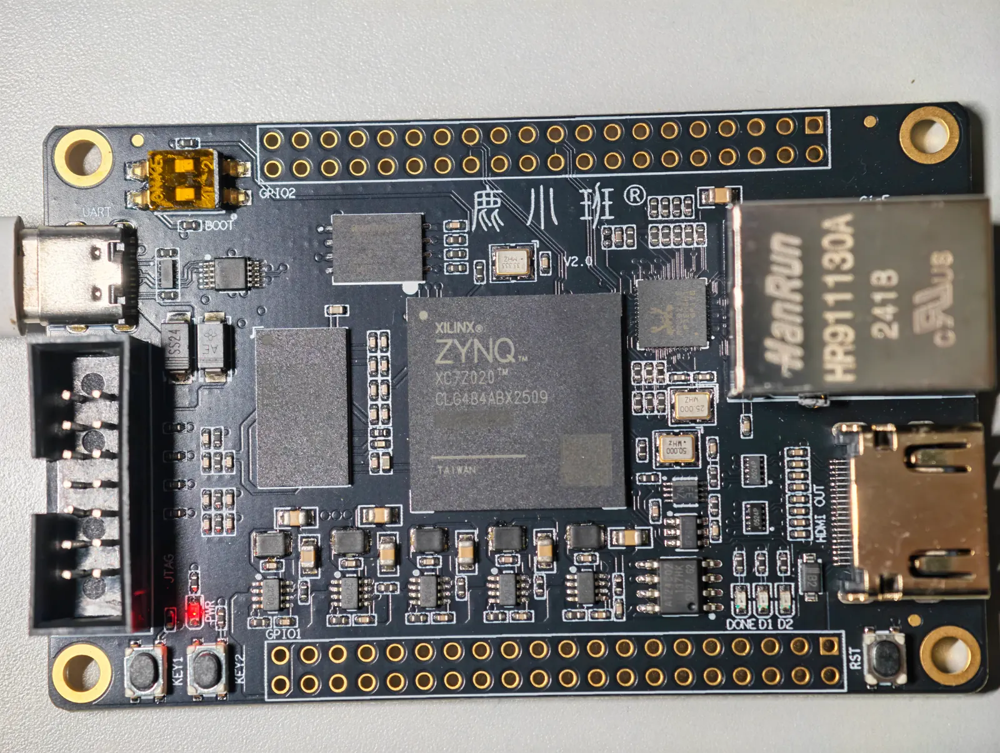

# MINI_7010 / Luban 7020 board comparison

The October 7, 2026 HelloZynq / Luban 7020 build executes the frozen wheel-legged
policy in **9.359 µs per complete INT16-input-to-action call**, with a **9.446 µs
P99** over 4,096 timed calls. Its mean is **4.997× lower** than the historical
MINI_7010 baseline of 46.766 µs. The improvement combines hardware and software
changes; it is not a controlled measurement of the chip substitution alone.



The supplied photo was reduced from 10,000 × 7,529 pixels / 117,837,244 bytes to
1,600 × 1,205 pixels / 281,956 bytes before upload. The original PNG is not
committed. Board markings and layout are preserved.

## Model and measurement boundary

Both deployments use the same frozen model:

```text
MODEL_SHA256=c2859573cbce1faef78d4333a2ad461389de9760b416c0896459c8d6ef4d263e
```

- Inputs: 25 observations and 125 history values; output: six actions.
- Operators: 7 GEMM, 5 ELU, 1 CONCAT; 13 descriptors and 38,400 MAC.
- Arithmetic: INT16 weights, Q8.8 activations/bias, INT48 accumulation.
- Per-GEMM weight fractional bits: `[11,12,14,13,14,14,14]`.

Complete-call timing starts with already quantized INT16 inputs and includes CPU
packing, input transfer, start/completion polling, and output readback/unpacking.
It excludes floating-point quantization, model loading, logs, and reference
comparison. Pure PL time excludes CPU handling. These boundaries are reported
separately.

## Timing evidence

| Configuration | Mean µs | P50 µs | P99 µs | Min µs | Max µs |
|---|---:|---:|---:|---:|---:|
| MINI_7010 historical batch | 46.766 | unavailable | unavailable | unavailable | unavailable |
| 7020, 100 MHz, traditional driver | 46.533 | 46.512 | 46.740 | 46.269 | 47.250 |
| 7020 optimized, Strongly Ordered MMIO | 17.999 | 17.990 | 18.287 | 17.710 | 18.378 |
| **7020 optimized, Device MMIO** | **9.359** | **9.355** | **9.446** | **9.308** | **9.595** |
| Same optimized image after another system reset | 9.354 | 9.347 | 9.449 | 9.308 | 9.681 |

The [7010 mailbox](../../docs/results/luban7020/mini7010_baseline_20260906.txt)
records `xc7z010 / 13722093`, interface `0x00010002`, successful DDR/cache smoke
checks, the expected actions, zero errors, and 1,558,877 timer ticks for 100 calls.
Using the recorded 666.666687 MHz CPU clock:

```text
1,558,877 / 333,333,343 × 1,000,000 / 100 = 46.766309 µs/call
```

That is a fixed-input batch average, not an individual latency distribution.
The 46.75–46.79 µs range in the [7010 port report](11_mini7010_vivado2026_port.md)
is a range of batch means. It cannot supply a P99 or individual min/max.

Each new 7020 mode times 4,096 calls over 256 distinct input/output cases. P50
and P99 use nearest ranks 2,048 and 4,056 after sorting. The 100 MHz bridge uses
the same model and traditional interface boundary, but different firmware,
compiler optimization, and inputs. It is an auxiliary baseline, not the same
ELF running on both boards.

Raw files: [100 MHz baseline](../../docs/results/luban7020/baseline_100mhz.json),
[optimized timing](../../docs/results/luban7020/optimized_166mhz.json),
[MMIO control](../../docs/results/luban7020/strongly_ordered_mmio.json),
[repeat reset](../../docs/results/luban7020/repeat_system_reset.json), and
[frozen release re-verification](../../docs/results/luban7020/release_verification.json).
The release re-verification again reports about 9.359 µs mean and 9.449 µs P99.

## What changed

| Item | MINI_7010 historical configuration | Optimized 7020 configuration |
|---|---|---|
| Build device | XC7Z010CLG400, conservative -1 grade | XC7Z020CLG484-2 |
| CPU / PL clocks | 666.667 / 100 MHz | 766.667 / 166.667 MHz |
| GEMM | One 8×8 array | Two 8×8 arrays sharing activations |
| Available DSP48E1 | 80 | 220 |
| Peak accepted cache-path work | 64 MAC/cycle | Up to 128 MAC/cycle |
| DDR | 512 MiB, x16, approximately 533 MHz | 512 MiB, x16, approximately 533 MHz |
| Input-word writes | Address + four data words + commit | Four ordered writes; final word commits |
| Control base | 0x43C00000 | 0x43C00000 |
| UART | UART1, MIO 48–49 | UART0, EMIO, TX L17 / RX M17 |

DSP input registers and additional arithmetic stages shortened critical paths.
ELU word streaming reduces serialization, and CONCAT reuses source words rather
than fetching each element again. The doubled arrays alone require 128
multiplier DSPs, exceeding the 7010's total capacity of 80.

The independent sequence-busy counter records **1,002 cycles** for every timed
input: `1002 / 166.666672 MHz = 6.012 µs`. The simulation's start-to-finish
boundary counts 1,003 cycles. The CPU-timed resident start-to-DONE path measures
about **6.280 µs** and includes launch/polling overhead.

The same 7020 bitstream, ELF, clocks, and corpus were also tested with two CPU
MMIO mappings. Strongly Ordered (`0xC02`) measured 17.999 µs; Device Memory
(`0xC06`) measured 9.359 µs: **1.923×**. The running CPU's translation-table
entry is included in the mailbox evidence. Device memory permits buffered
writes while preserving peripheral order; the registers are not mapped as
ordinary cacheable RAM. A DSB completes setup writes before timing begins.

This controlled MMIO comparison supports attributing that difference to access
policy. The overall fivefold improvement also changes geometry, clocks, and
software paths, so it cannot establish the isolated effect of each change.
Some software improvements can also be applied to 7010.

## Resources and timing qualification

The final [routed report](../../docs/results/luban7020/utilization.rpt) uses:

| Resource | Used | XC7Z020 capacity | Occupancy |
|---|---:|---:|---:|
| LUT | 18,336 | 53,200 | 34.47% |
| FF | 14,239 | 106,400 | 13.38% |
| DSP48E1 | 132 | 220 | 60.00% |
| BRAM36 equivalents | 100.5 | 140 | 71.79% |

The two MAC arrays use 128 of those DSPs. BRAM equivalents count 100 RAMB36 plus
one RAMB18. The dual-read implementation replicates weight memory; logical
capacity remains eight banks of 1,280 × 128 bits, 512 vector words, and 32
instructions. More device memory has not automatically enlarged the model cache.

The [timing report](../../docs/results/luban7020/timing_summary.rpt) passes all
user-specified setup, hold, and pulse-width constraints: **WNS +0.093 ns,
WHS +0.054 ns**. Tested 180/200 MHz candidates with negative slack were excluded.
A true-dual-port memory trial reduced usage to 68.5 BRAM equivalents but failed
timing at the tested frequencies and was not selected. This is the fastest
qualified build tested here, not a proof of a global architecture optimum.

7010 resource reports and the historical latency log belong to different build
versions. The later generic v3 report uses 13,041 LUT, 9,569 FF, 68 DSP, and 52.5
BRAM equivalents; those values must not be presented as resources of the older
v1.2 latency run. The historical [port report](11_mini7010_vivado2026_port.md)
documents the earlier 72-DSP implementation separately.

## Numerical and stress checks

The [optimized mailbox](../../docs/results/luban7020/optimized_mailbox.txt) and
[release mailbox](../../docs/results/luban7020/release_mailbox.txt) retain raw
32-bit words as well as parsed results. Each selected build passed:

- **16,384 reference-checked inferences**: four modes, 4,096 calls per mode,
  all six outputs compared element by element with independent NumPy INT64 math.
- **1,048,576 consecutive stress calls**, cycling 256 varied inputs; zero
  errors. This is not a million independently sampled inputs or a thermal-aging test.
- **21,808 cache-word readbacks**: two complementary patterns across all
  8 × 1,280 weight words, 512 vector words, and 32 instruction words, plus all
  240 input-window words.
- **16 GEMM outputs across weight words 1023/1024**, exercising both sides of
  the main/tail memory boundary, and **9 VECTOR/SFU checks**.

The timed suite poisons output memory before inference to reject stale results.
Primitive tests restore the full 13-instruction network before measuring it.
System reset, initialization, and JTAG download were repeated successfully;
these repeats are not power-cycle cold-boot tests.

## Build identity and publication scope

```text
INTERFACE_VERSION=0x00010005
BIT_SHA256=d00f5dec62e940acfad0b29c86a41b7978d7fa225f25e6bba88e69d725020278
ELF_SHA256=3c6fc0133664fc732192b5e16a2ada3cca6bfa72921ef72273b667424ace8743
CONFIGURATION_PAYLOAD_SHA256=15d99e09d8ce27671f74d37335463a28158007b6ac2d6c5e4cf22150800da816
```

The XSA's embedded bit and the separately written bit have different creation
time headers, but byte-identical FPGA configuration payloads. The frozen release
was reprogrammed and re-verified against the hashes above.

The optimized RTL and standalone firmware were built in the local Luban
board-port workspace for this run. This documentation update publishes the
measurement evidence and build identities. The GitHub quickstart continues to
verify the checked-in reference implementation.

The 7010 board was not reconnected for a matched updated-firmware experiment.
External UART connectivity, QSPI/SD persistent boot, power, energy, prolonged
thermal steady state, external data-stream throughput, other models' 7020 board
timing, and real robot closed-loop behavior were not measured in this run.
JTAG programming here is volatile. Hardware-integer agreement does not establish
a new control-quality result or an INT8 deployment.
